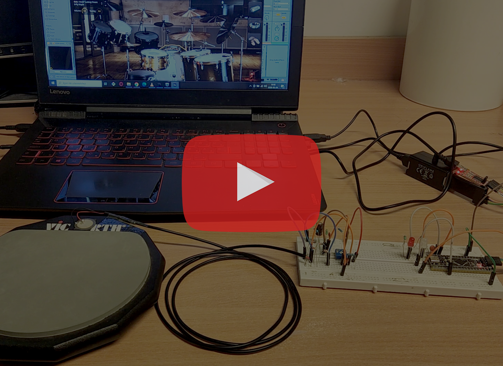
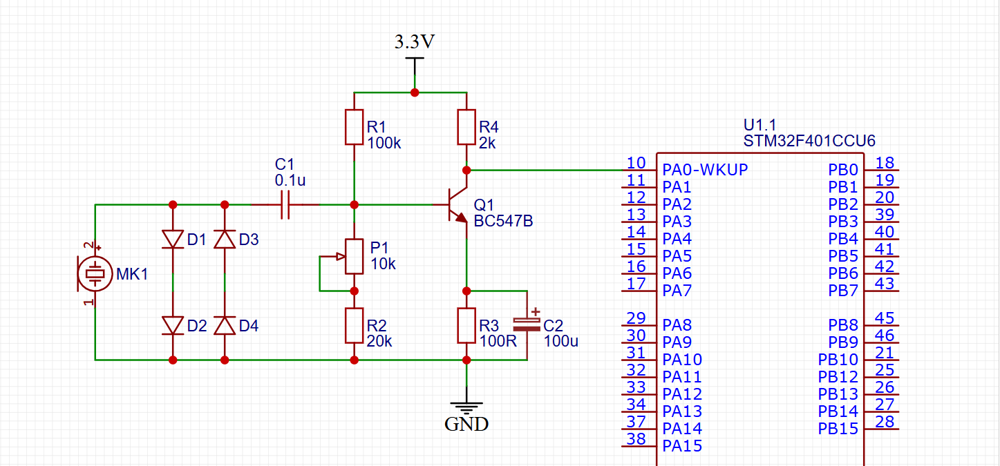
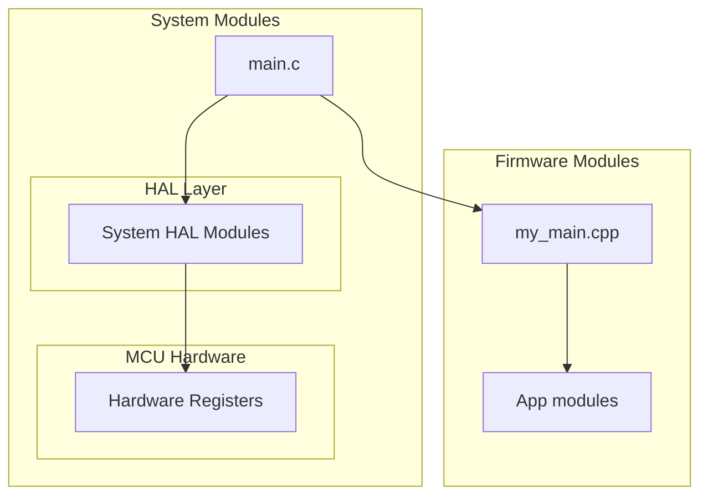
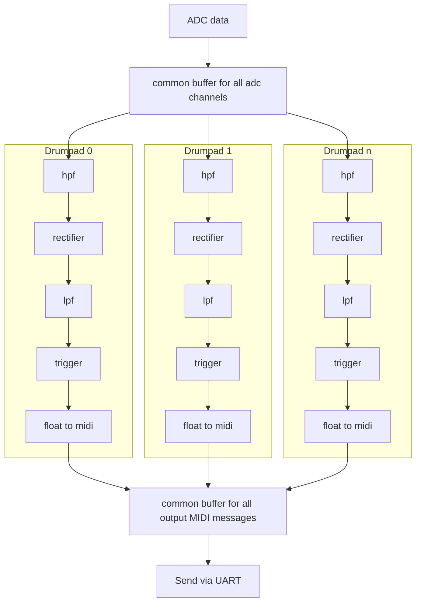
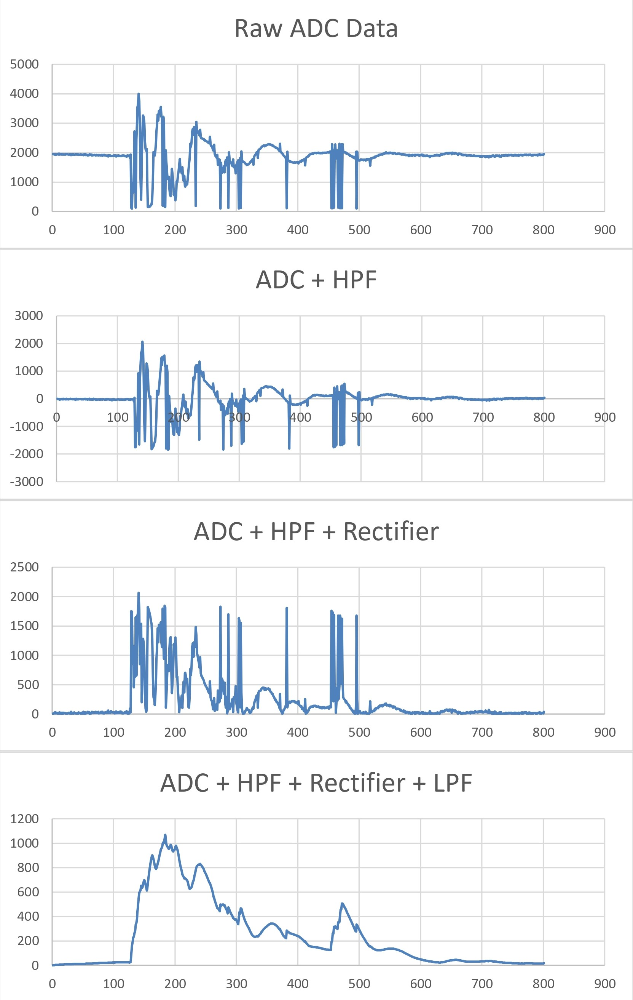

# MIDI Drum - Firmware for converting piezo sensor data to MIDI signals using STM32F401CCU6 MCU


## General Information

This project aimed to create a simple but well optimised firmware, what is processing piezo mics outputs, and converts it into MIDI signal. In this project I used `C++` language and put all signal processing elements into one class. Because of that, you can easily configure as many Drumpad objects as you want. For the tests (and in the video), I used `Ableton` and `EZdrummer` for generating snare sounds from the midi input, and used `Hairless MIDI` and `LOOP MIDI` for the serialport-midi connection.


## Video of device in operation

[](https://www.youtube.com/watch?v=JJb1YHg9BPs)


## Technical Specifications

MCU: STM32F401CCU6

Language: C++ / C 

IDE: STM32CubeIDE 1.15.1

## Features

- ✔️ Collecting ADC signals using DMA
- ✔️ Convert input signal to MIDI velocity
- ✔️ Send MIDI signals via UART
- 🚧 Send MIDI signals via USB-MIDI protocol
- 🚧 User Interface
    - 🚧 OLED Display
    - 🚧 Menu
    - 🚧 Encoder, Buttons
    - 🚧 Save data to external EEPROM
- 🚧 Use OP-Amps instead BJTs for the balanced transmission


✔️ = Done, ❌ = Interrupted, 🚧 = In Progress 

## Hardware 



## Software Architecture

I tried to keep the software architecture very simple and separate the firmware from the hadware specific elements of the code. STM32CubeIDE generates code in `main.c` automatically and defines structures that containing the peripherals datas. Because of this, I put all hardware-specific functions into `main.c`.

Solely the `main.c` can calls functions from the `my_main.cpp` module. However, `my_main.cpp` needs to use some functions from `main.c`. To solve this, `main.c` sends these functions adresses using pointers. This way, the other module can reach and use them.




## Dataflow Diagram


## Excel charts representing different data stages



## Folder Structure

```
         
Firmware/                   # all firmware modules
    ├── Inc/                # header files
    └── Src/                # source files
       
``` 

## Author 
[Bagó Bálint](https://github.com/bagobalint10) – [LinkedIn](https://www.linkedin.com/in/b%C3%A1lint-bag%C3%B3-49000123a/)  

2025/03/02

